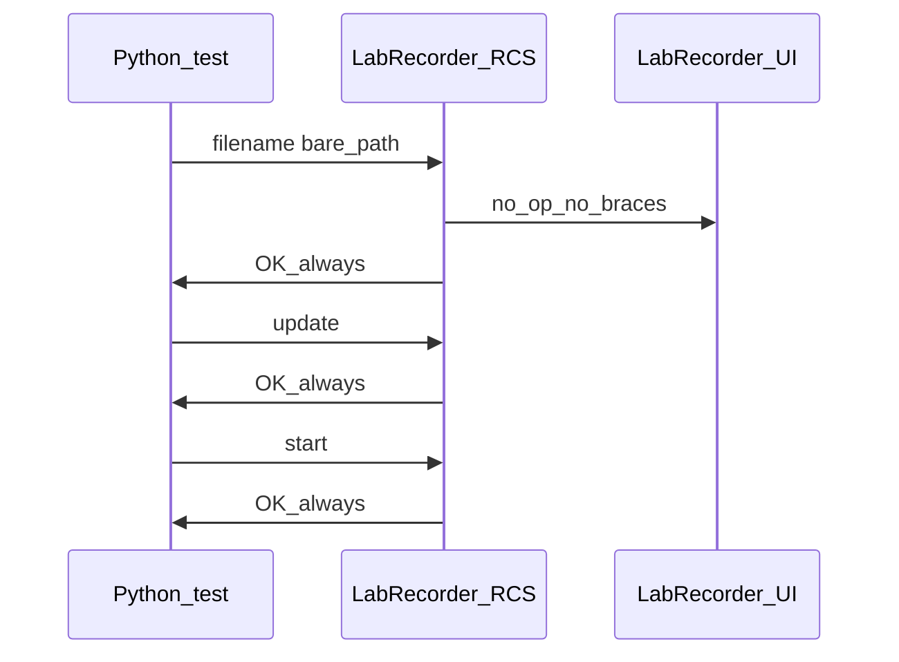

# Fix external LabRecorder RCS “Start” / empty XDF

## What is actually going wrong

Your log line `[External] start -> OK` is **misleading** for the C++ app. In upstream [App-LabRecorder `tcpinterface.cpp`](https://github.com/labstreaminglayer/App-LabRecorder/blob/master/src/tcpinterface.cpp), **every** handled line ends with `sock->write("OK")` unconditionally. So `OK` only means “line was read”, not “recording started”.

The real functional bug is **`filename`**: upstream [`MainWindow::rcsUpdateFilename`](https://github.com/labstreaminglayer/App-LabRecorder/blob/master/src/mainwindow.cpp) only updates Study Root and File Name / Template from **curly-brace tokens** (`{root:...}{template:...}` etc.). A command like `filename C:\...\external_2026....xdf` has **no** `{...}` matches, so the handler does nothing. That matches your UI: **Saving to** still shows [`labrecorder/default_external_labrecorder.cfg`](labrecorder/default_external_labrecorder.cfg) `PathTemplate=labrecorder_external_fallback.xdf`, while the test only checks [`external_<timestamp>.xdf`](tests/test_dual_xdf_recording.py) under `data/_test_xdf_output/` — so validation correctly reports **missing or empty** even if something was written elsewhere (e.g. repo cwd under the fallback name).

For comparison, this repo’s Python RCS **does** support `filename <path>` without braces in [`labrecorder/remote_control/commands.py`](labrecorder/remote_control/commands.py) (`_handle_filename`), which is why the internal recorder path works but the C++ path does not.

## Recommended code changes (after plan approval)

1. **[`tests/test_dual_xdf_recording.py`](tests/test_dual_xdf_recording.py)** — In `start_external_cpp_recorder`, replace the bare `filename {external_path}` with the C++-expected form, e.g. split `external_path` into parent directory and basename and send one line such as:
   - `filename {root:<parent>}{template:<basename>}`
   - Use a path form RCS tolerates on Windows (prefer `Path.as_posix()` or doubled backslashes per [App-LabRecorder README](https://github.com/labstreaminglayer/App-LabRecorder) examples).

2. **Optional hardening** — After `update` and the existing sleep, send `select all` before `start` (matches official README order and matches your Python handler in [`commands.py`](labrecorder/remote_control/commands.py) which refuses `start` without selected streams). Upstream C++ `rcsStartRecording` already calls `selectAllStreams()`, but an explicit command costs little and protects a custom fork.

3. **[`labrecorder/launch_and_control_external_cpp_labrecorder_app.py`](labrecorder/launch_and_control_external_cpp_labrecorder_app.py)** — Short comment near `send_rcs_command` / module docstring: **C++ LabRecorder may always respond `OK`; do not treat it as proof that recording started or that `filename` was applied.** Optionally extend `run_labrecorder_capture` later with brace-`filename` if you need a fixed path there too (currently it only uses `update` + `start` + `recordingpath`).

## Verification

- Re-run `uv run python tests/test_dual_xdf_recording.py`.
- Confirm LabRecorder **Saving to** shows the intended basename and that `data/_test_xdf_output/external_*.xdf` exists and is non-empty.
- If anything still fails, inspect whether your local `App-LabRecorder` fork diverged from upstream `rcsUpdateFilename` / `rcsStartRecording` (compare your tree to upstream `mainwindow.cpp`).
