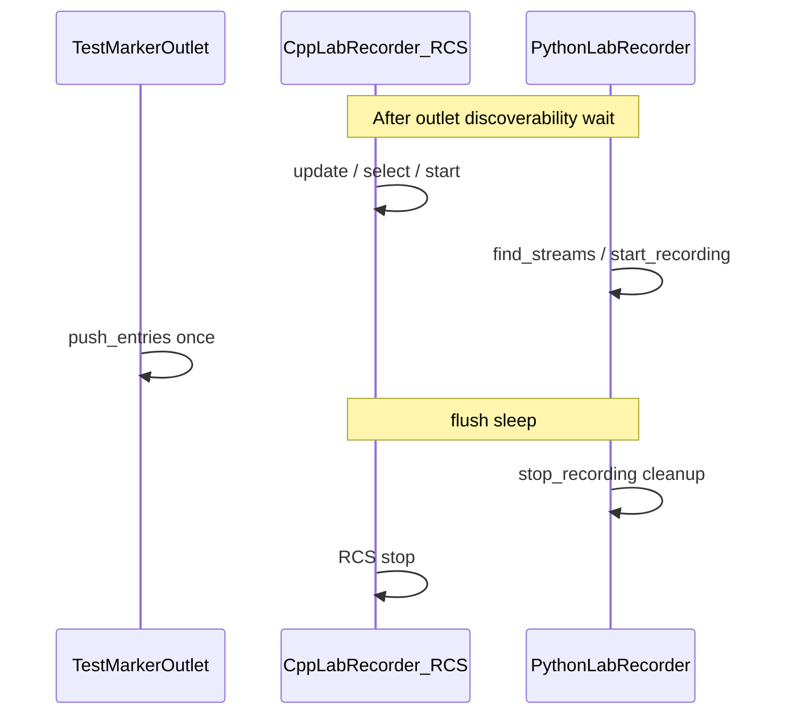

# Parallel dual XDF recording test

## Current behavior vs goal

- **Today**: The script runs **sequentially**: first [`run_builtin_recorder`](C:\Users\pho\repos\EmotivEpoc\ACTIVE_DEV\lab-recorder-python\tests\test_dual_xdf_recording.py) (Python [`LabRecorder`](C:\Users\pho\repos\EmotivEpoc\ACTIVE_DEV\lab-recorder-python\labrecorder\recorder.py)), then [`run_rcs_recorder`](C:\Users\pho\repos\EmotivEpoc\ACTIVE_DEV\lab-recorder-python\tests\test_dual_xdf_recording.py), which is **still** an in-process Python `LabRecorder` with RCS—not the C++ app launched by subprocess.
- **Goal**: While the shared [`TestMarkerOutlet`](C:\Users\pho\repos\EmotivEpoc\ACTIVE_DEV\lab-recorder-python\tests\test_dual_xdf_recording.py) pushes `TEST_LOG_ENTRIES` **once**, both backends record in parallel:
  1. **Internal**: same as today—`LabRecorder(..., enable_remote_control=False)`, `find_streams` / `start_recording` / `stop_recording` / `cleanup`.
  2. **External**: C++ `LabRecorder.exe` + ephemeral RCS port, using the same building blocks as [`ExternalLabRecorderInstance.run_labrecorder_capture`](C:\Users\pho\repos\EmotivEpoc\ACTIVE_DEV\lab-recorder-python\labrecorder\launch_and_control_external_cpp_labrecorder_app.py) (`build_temp_config`, `launch_labrecorder`, `wait_for_rcs`, `send_rcs_command`), extended so the output path is deterministic (see below).

LSL allows multiple inlets on the same advertised stream; each recorder gets its own copy of samples as long as both are pulling **before** (and during) the push window.

## Orchestration (single push, two files)

- **Start order**: Bring the **external** recorder to “recording” first (`update` → short wait → `select all` if needed → `start`), then start the **internal** recorder. External startup is slower; starting internal second reduces risk of missing early samples on the Python side.
- **RCS `filename`**: Before `start`, send `filename <absolute_external_path>` via [`ExternalLabRecorderInstance.send_rcs_command`](C:\Users\pho\repos\EmotivEpoc\ACTIVE_DEV\lab-recorder-python\labrecorder\launch_and_control_external_cpp_labrecorder_app.py) so the C++ file lands next to the built-in file under your test output dir (same pattern as the current test’s `send_rcs_command(f"filename {output_path}", ...)`). If your fork does not support `filename`, fall back to `recordingpath` after `start` and document that the path is config-defined.
- **Stop**: After a short flush sleep (keep ~1s), call internal `stop_recording` + `cleanup`, then RCS `stop` on the external port ([`request_labrecorder_stop_via_rcs`](C:\Users\pho\repos\EmotivEpoc\ACTIVE_DEV\lab-recorder-python\labrecorder\launch_and_control_external_cpp_labrecorder_app.py) or direct `send_rcs_command`). Optionally `terminate` the `Popen` if the test must not leave the GUI process running (product decision: leave process for inspection vs. clean exit).
- **Parallelism**: The meaningful requirement is **overlap**: both recorders are active during the **same** `push_entries` call. Optional: use two threads only for the “start recording” phase to minimize the gap between external and internal “recording on” if you want stricter simultaneity; not required if ordering above is tight enough.

## Imports and helpers

- Import `ExternalLabRecorderInstance` (and optionally `DEFAULT_HOST`) from `labrecorder.launch_and_control_external_cpp_labrecorder_app`.
- Resolve paths with `ExternalLabRecorderInstance.resolve_exe_path()` and `resolve_config_path()` so `LABRECORDER_EXE` / `LABRECORDER_CONFIG` override defaults (same as the launcher module).
- Prefer **`ExternalLabRecorderInstance.send_rcs_command`** for the C++ session instead of the test’s local `send_rcs_command`: the class version reads until the response contains `OK`, matching the real RCS protocol and avoiding truncated replies.
- Replace **`run_rcs_recorder`** with something like `run_parallel_dual_recording(builtin_path, external_path, outlet)` (or keep small helpers but one `main` flow) that owns the full lifecycle above.

## Skip / fail fast when C++ is unavailable

- If `exe_path` or `base_config_path` is missing, print a clear message and exit non-zero (or `pytest.skip` if you later wire this as a pytest test). This avoids brittle failures on machines without App-LabRecorder / Emotiv cfg.

## “Exact same data” expectations

- The README already states that files may not be **byte-for-byte** identical ([README.md](C:\Users\pho\repos\EmotivEpoc\ACTIVE_DEV\lab-recorder-python\README.md) XDF parity section). The test should assert **logical equality** for the marker stream:
  - Same number of samples as `TEST_LOG_ENTRIES`.
  - Same string sequence in order.
  - Optional: timestamps within a small tolerance (different clock-offset handling / chunk timing).
- Add a small `compare_marker_streams(path_a, path_b)` using `pyxdf` (reuse stream lookup by `TestMarkerOutlet.STREAM_NAME`) and call it from `main` after `validate_xdf` for both files.

## Docstrings and paths

- Update the module docstring to describe **external C++ + internal Python** parallel recording (remove the inaccurate “Method 2: separate LabRecorder instance” if it implied another Python process).
- Fix **output root**: `REPO_ROOT = Path(__file__).resolve().parents[2]` points **above** `lab-recorder-python` for a file under `tests/`; use `parents[1]` if outputs should live under this repo’s `data/` (and align the usage comment with `lab-recorder-python`).

## Scope boundary

- **Test-only change** unless you explicitly want a shared helper on `ExternalLabRecorderInstance` (e.g. `start_recording_session(...) -> (proc, port, recording_path)`); the test can call existing `@classmethod`s without modifying the launcher module.
