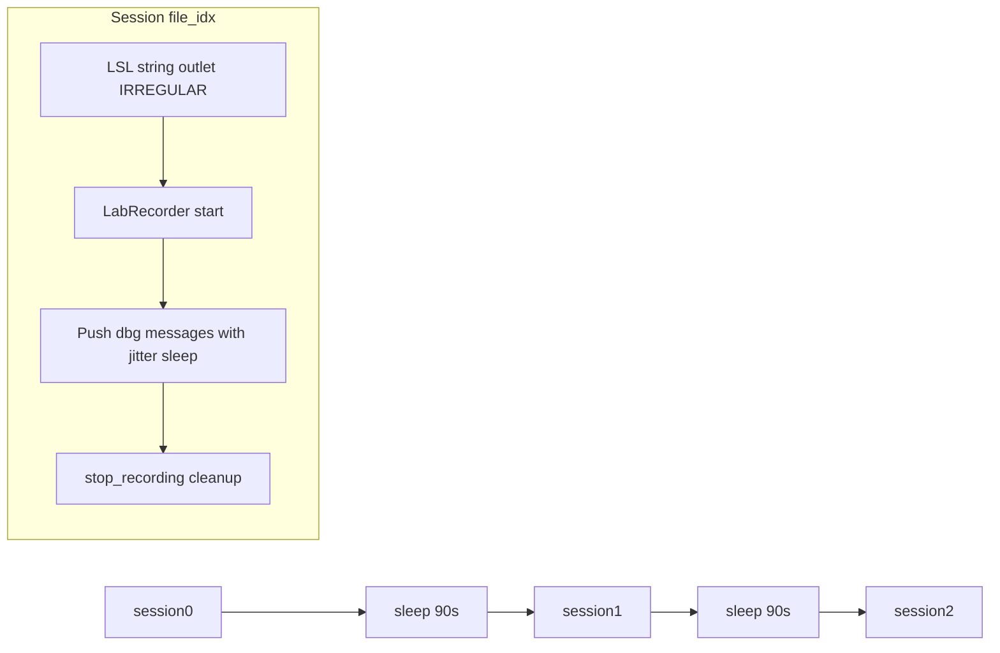

# Standalone sequential debug XDF generator

## Interpretation of your spec

- **Three files**: three separate recording sessions, each writing one `.xdf` (e.g. `seq_debug_0.xdf`, `seq_debug_1.xdf`, `seq_debug_2.xdf`).
- **1.5 minutes between “streams”**: treat as **90 seconds of idle time between sessions** — after `stop_recording` / outlet teardown for file *N*, sleep 90s, then start the next outlet + recording for file *N+1*. That yields three distinct XDF timelines separated by gaps (no LSL samples during the gap if the outlet is destroyed after each session).
- **Irregular-rate text**: match [`TestMarkerOutlet`](tests/test_dual_xdf_recording.py) — `nominal_srate=pylsl.IRREGULAR_RATE`, `channel_format=pylsl.cf_string`, `channel_count=1`.
- **Message body**: `f"xdf[{file_idx}]: dbg message {i}"` for `i = 0, 1, …`.
- **Timing between messages**: after each push, `time.sleep(random.uniform(5.0, 15.0))` so the mean is ~10s with ±5s jitter (uniform on [5, 15]).

**Open default (resolved in implementation, not blocking you):** you did not specify how many messages per file or total wall time per file. The script should expose **`--num-messages`** (default e.g. `12`, ~2 minutes at ~10s spacing) and optionally **`--gap-seconds`** (default `90`) and **`--output-dir`** so you can tune without editing code.

## Why not reuse `xdf_test_utils.py` here

[`tests/xdf_test_utils.py`](tests/xdf_test_utils.py) is for **synthetic inlets**, fixture download, and `pyxdf` normalization for assertions — it does not write XDF from live LSL. Keeping the generator **out of** that module matches “independent from all the other scripts” and avoids coupling tests to a long-running generator.

## Implementation approach

Add **one new file** at the repo root or under a new `scripts/` folder, e.g. `scripts/generate_sequential_debug_xdfs.py` (runnable with `uv run python scripts/generate_sequential_debug_xdfs.py` from repo root).

Per file index `file_idx in (0, 1, 2)`:

1. If `file_idx > 0`: `time.sleep(gap_seconds)`.
2. Build a dedicated `pylsl.StreamInfo` (unique `source_id` per file, e.g. `seq_debug_xdf_{file_idx}`, stable `name` like `SeqDebugText`) so `find_streams` cannot confuse a stale resolver entry with a previous session.
3. `StreamOutlet`, short settle sleep (same order of magnitude as the dual test: ~0.5–2s) so the stream is visible.
4. Instantiate [`LabRecorder`](labrecorder/recorder.py) with `enable_remote_control=False`, output path for that index, and the same practical config as the dual test where relevant: `recorder.config.set("streams.watch_for_new_streams", False)` (and optional `recording.boundary_interval` / `recording.clock_sync_interval` if you want parity with [`test_dual_xdf_recording.py`](tests/test_dual_xdf_recording.py) lines 278–281).
5. `find_streams` → select the outlet by `name` + `source_id` (or UID).
6. `start_recording(filename=..., streams=[...])`.
7. Loop `i in range(num_messages)`: `push_sample([msg], timestamp=pylsl.local_clock())`, then jittered sleep.
8. Short post-push sleep (~1s), `stop_recording()`, `cleanup()`, then let the outlet go out of scope (or explicit del) before the next iteration.

**Optional:** end with a `pyxdf.load_xdf` summary print (sample count, nominal_srate, first/last message) — uses an existing dependency from [`pyproject.toml`](pyproject.toml).

## Dependencies and run

- Uses **`pylsl`**, **`labrecorder.LabRecorder`**, **`pyxdf`** (optional validate). No C++ LabRecorder, no RCS, no imports from `tests/`.
- Run: `uv run python scripts/generate_sequential_debug_xdfs.py` (or path you choose).

## Mermaid (high-level)

## Files touched

| Action | File |
|--------|------|
| Add | `scripts/generate_sequential_debug_xdfs.py` (new; ~120–180 lines with argparse + docstring) |
| No change | [`tests/xdf_test_utils.py`](tests/xdf_test_utils.py), [`tests/test_dual_xdf_recording.py`](tests/test_dual_xdf_recording.py) |

If you later want pytest coverage for “three files exist and strings match pattern”, that would be a **separate** slow/integration test (skipped by default) — not part of this minimal deliverable unless you ask for it.
